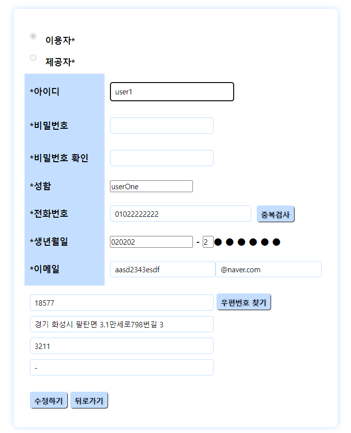
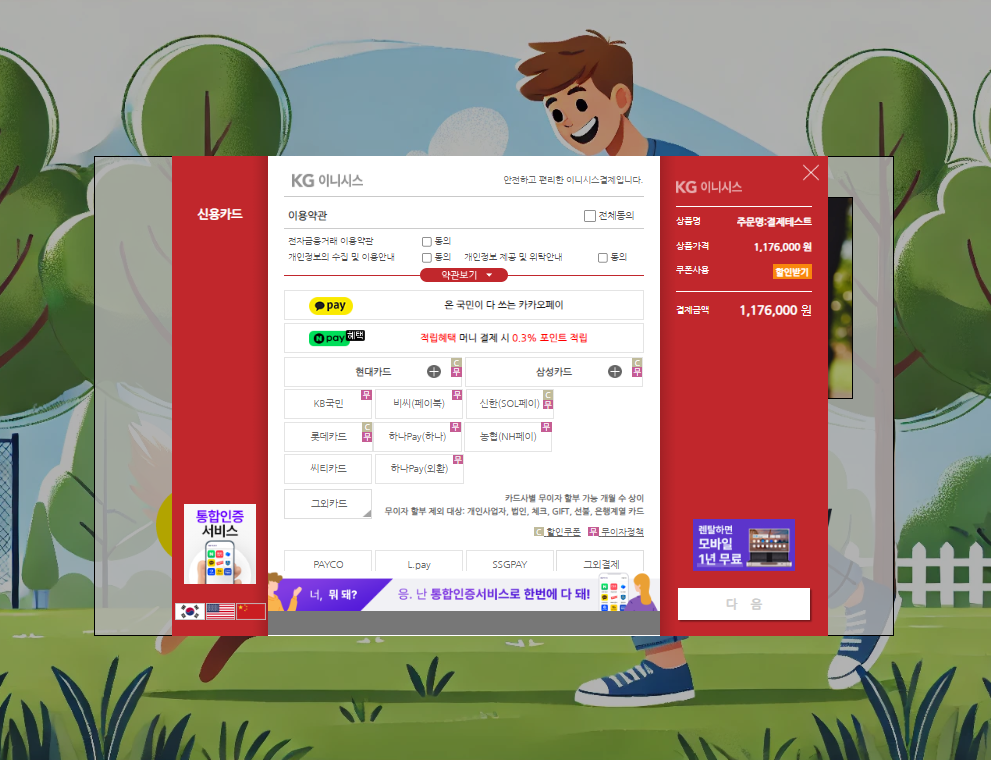

# 🐶 돌봐줄개 멍멍 - 펫케어 서비스

### 📚 KH정보교육원 파이널 프로젝트

**최종 수정 날짜: 2024년 7월 26일**

---

**하단의 기능들은 모두 제가(심민재본인) 구현한 화면들입니다.**

---

## 목차
1. [🎯 프로젝트 목적](#-프로젝트-목적)
2. [🏠 프로젝트 배경](#-프로젝트-배경)
3. [💻 개발 환경](#-개발-환경)
4. [📊 ERD](#-erd)
5. [📸 프로젝트 화면](#-프로젝트-화면)
6. [🛠️ 트러블슈팅 사례](#-트러블슈팅-사례)

---

## 🎯 프로젝트 목적
**돌봐줄개 멍멍**은 애완동물 주인(고객)과 펫시터를 연결하여 애완동물의 돌봄 서비스를 편리하게 제공받을 수 있도록 하는 플랫폼입니다. 고객이 여행, 출장, 기타 일정으로 인해 애완동물을 돌볼 수 없을 때, 신뢰할 수 있는 펫시터를 쉽게 찾고 예약할 수 있도록 돕는 것을 목적으로 합니다.

---

## 🏠 프로젝트 배경
최근 사회적 변화로 인해 **1인 가구가 급격히 증가**하고 있습니다. 이와 더불어 **혼자서 강아지를 키우는 가구** 또한 늘어나고 있습니다. 이러한 1인 가구의 애완동물 주인들은 출장, 여행, 장시간 외출 등의 이유로 강아지를 돌볼 사람이 필요할 때가 많습니다. **돌봐줄개 멍멍**은 이러한 필요를 충족시키기 위해 개발되었습니다.

---

## 💻 개발 환경
- **🖥️ OS**: Windows 10
- **🔧 DevTools**: Spring Tool Suite 3
- **🗄️ DBMS**: Oracle 11g
- **🌐 Server**: Apache Tomcat
- **💻 Language**: JAVA
- **📚 Framework**: Spring
- **🌐 Frontend**: HTML5, CSS3, Javascript, jQuery, Chart.js(차트)
- **🛠️ Backend**: Maven, MyBatis, JSTL, Spring Security, Iamport API(결제 모듈), Naver Mail API(메일 인증)

---

## 📊 ERD

---

## 📸 프로젝트 화면

### 🏠 메인 화면

### 📝 회원가입 화면

### 🔒 아이디 및 비밀번호 찾기 화면

### 🔑 로그인 화면

### 🏡 로그인 후 화면

### 👤 개인정보 수정 화면

### 📧 메일 인증 화면

### 📅 내가 만든 예약 화면

### 💳 결제 화면

### 💳 카카오 결제 화면

### 💳 KG 결제 화면

### 💳 토스 결제 화면

### 🛠️ 관리자 메인 화면

### 🛠️ 관리자 로그인 이후 화면

### 👥 고객 정보 화면

### 📊 차트JS 화면

---

## 🛠️ 트러블슈팅 사례

### 1. 이슈: 외부 링크를 통한 결제 페이지 직접 접근 문제

| **구분**  | **내용**                                                                                                            |
|-----------|---------------------------------------------------------------------------------------------------------------------|
| **문제**  | 사용자가 외부 링크나 즐겨찾기를 통해 결제 페이지에 직접 접근하여 정상적인 결제 절차를 우회하고, 데이터 불일치나 결제 실패가 발생했습니다. |
| **원인**  | - 결제 페이지로 직접 접근하는 경우 정상적인 절차를 거치지 않아 시스템이 예상하지 못한 흐름이 발생. - 세션 데이터가 유효하지 않거나, 필요한 파라미터가 부족하여 결제가 정상적으로 처리되지 않음. |
| **해결 방법** | - 올바른 접근 경로를 확인하기 위해 JSP에 `<c:if>` 조건문을 추가하여 비정상적인 접근을 차단. - HTTP `Referer` 헤더를 통해 사용자가 정상적인 경로에서 결제 페이지로 이동했는지 확인. - 필요한 세션 정보 및 파라미터 검증 후, 유효하지 않을 경우 경고 메시지와 함께 예약 페이지로 리다이렉트. - 비정상적인 접근 시도에 대한 로그를 강화하여 추가적인 보안 조치를 적용. |

---
